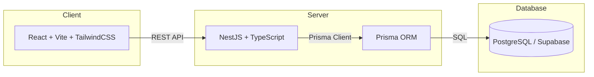

<p align="center">
  
</p>

<h1 align="center">📚 Tín Chỉ Campus — Course Registration System</h1>

<p align="center">
  A full-stack academic course registration platform for <strong>PTIT Ho Chi Minh City</strong>, built as a final project for the Software Engineering course.
</p>

<p align="center">
  <a href="https://github.com/athanhneee/CNPM_NHOM25/actions/workflows/ci.yml"></a>
  <a href="https://github.com/athanhneee/CNPM_NHOM25/blob/main/LICENSE"></a>
  
  
</p>

<p align="center">
  <a href="https://ptitdangkyhocphan.vercel.app/"><strong>🌐 Live Demo</strong></a> ·
  <a href="#-getting-started"><strong>Getting Started</strong></a> ·
  <a href="#-api-documentation"><strong>API Docs</strong></a> ·
  <a href="#-documentation"><strong>Docs</strong></a>
</p>

---

## ✨ Features

| Role | Capabilities |
|------|-------------|
| **🎓 Student** | Browse course catalog · Register / drop / swap sections · Waitlist management · View weekly & semester schedules · Submit course wishes · View transcript & GPA |
| **👨‍🏫 Lecturer** | View assigned sections · Student roster per section · Weekly & semester teaching schedule |
| **🏫 Academic Office** | Manage course catalog & sections · Assign lecturers & rooms · Process waitlist & overrides · Enrollment reports · Review / approve course wishes |
| **🔧 Admin** | User management (CRUD, lock/unlock) · Bulk student import (Excel) · System settings & session timeout · Audit logs · Data export / import snapshots |

---

## 🏗️ Architecture



---

## 🛠️ Tech Stack

| Layer | Technologies |
|-------|-------------|
| **Frontend** | React 19, Vite 8, TypeScript 5.9, Tailwind CSS 4, Zustand, React Router 7, React Hook Form + Zod, Lucide Icons |
| **Backend** | NestJS 10, TypeScript, Prisma ORM 5, Swagger/OpenAPI, JWT + RBAC, bcrypt |
| **Database** | PostgreSQL (Supabase hosted), Prisma Migrations |
| **CI/CD** | GitHub Actions, Vercel (frontend deployment) |
| **Tooling** | Docker Compose, ESLint, Playwright (E2E), Node.js 24 |

---

## 📁 Project Structure

```text
CNPM_NHOM25/
├── backend/              # NestJS API server
│   ├── prisma/           # Schema, migrations & seed data
│   └── src/              # Modules: auth, users, courses, enrollments, etc.
├── frontend/             # React SPA
│   ├── src/
│   │   ├── features/     # Role-based pages (student, lecturer, academic, admin)
│   │   ├── components/   # Shared UI components
│   │   ├── lib/          # Utilities & helpers
│   │   ├── mocks/        # Mock data & seed fallback
│   │   └── types/        # TypeScript type definitions
│   └── public/           # Static assets
├── docs/                 # Analysis, design, test plan & demo scripts
├── database/             # Database setup documentation
├── docker-compose.yml    # Container orchestration
└── .github/workflows/    # CI pipeline
```

---

## 🚀 Getting Started

### Prerequisites

- **Node.js** ≥ 20 (recommended: 24)
- **npm** ≥ 9
- **PostgreSQL** database (or [Supabase](https://supabase.com) free tier)

### 1. Clone the repository

```bash
git clone https://github.com/athanhneee/CNPM_NHOM25.git
cd CNPM_NHOM25
```

### 2. Backend setup

```bash
cd backend
npm install
cp .env.example .env          # Then edit .env with your database credentials
npx prisma generate
npx prisma migrate dev
npm run prisma:seed            # Populate demo data (160 courses, 18 lecturers, 9 students)
npm run start:dev              # Starts at http://localhost:3000
```

### 3. Frontend setup

```bash
cd frontend
npm install
cp .env.example .env           # Default API URL: http://localhost:3000/api
npm run dev                    # Starts at http://127.0.0.1:5173
```

### 4. Docker (alternative)

```bash
docker-compose up --build
```

---

## 📖 API Documentation

Once the backend is running, Swagger UI is available at:

```
http://localhost:3000/api
```

Full API contract: [`backend/API_CONTRACT.md`](backend/API_CONTRACT.md)

---

## 🔐 Demo Accounts

All demo accounts use the same default password: **`ptithcm2026`**

| Role | Username | Email |
|------|----------|-------|
| 🔧 Admin | `admin` | `admin@ptithcm.edu.vn` |
| 🏫 Academic Office | `academic.office` | `academic.office@ptithcm.edu.vn` |
| 👨‍🏫 Lecturer | `minh.tuan` | `minh.tuan@ptithcm.edu.vn` |
| 🎓 Student | `N23DCCN001` | `n23dccn001@student.ptithcm.edu.vn` |
| 🎓 Student | `N23DCCN002` | `n23dccn002@student.ptithcm.edu.vn` |
| 🎓 Student | `N23DCAT001` | `n23dcat001@student.ptithcm.edu.vn` |
| 🎓 Student | `N23DCVT001` | `n23dcvt001@student.ptithcm.edu.vn` |
| 🎓 Student | `N23DCDT001` | `n23dcdt001@student.ptithcm.edu.vn` |

> **Tip:** The Admin Settings page has a `simulationNow` field to change the demo timestamp — useful for demonstrating registration windows, adjustment periods, and deadlines without modifying seed data.

---

## ✅ Testing

### Backend

```bash
cd backend
npm run lint                    # ESLint
npm run test:rules              # Business rule smoke tests
npm run test:integration        # Integration tests (requires TEST_DATABASE_URL)
npm run build                   # TypeScript compilation check
```

### Frontend

```bash
cd frontend
npm run lint                    # ESLint
npm run test                    # Unit / seed smoke tests
npm run test:e2e                # Playwright end-to-end tests
npm run build                   # Production build
```

> ⚠️ Only run `test:integration` when `TEST_DATABASE_URL` points to a **separate** test database. The script resets and re-seeds the database.

---

## 📊 Demo Checklist

<details>
<summary><strong>🎓 Student Flow</strong></summary>

- Login with `N23DCCN001` or `N23DCCN002`
- Browse available courses and section details
- Register for an open section
- Attempt to register for a full section → waitlist
- View registration history and weekly schedule
- Submit and cancel course wishes

</details>

<details>
<summary><strong>👨‍🏫 Lecturer Flow</strong></summary>

- Login with `minh.tuan`
- View assigned sections and student rosters
- Check weekly and semester teaching schedules

</details>

<details>
<summary><strong>🏫 Academic Office Flow</strong></summary>

- Login with `academic.office`
- Manage course catalog and sections
- Create sections, assign lecturers, update rooms/schedules
- Monitor enrollment, process waitlist, override registrations
- View enrollment fill-rate reports
- Review and approve/reject course wishes with feedback

</details>

<details>
<summary><strong>🔧 Admin Flow</strong></summary>

- Login with `admin`
- Manage user accounts (create, lock/unlock, bulk import)
- Update system parameters and session timeout
- Export/import data snapshots
- View audit logs

</details>

---

## 📚 Documentation

| Document | Description |
|----------|-------------|
| [Analysis & Design](docs/analysis-design.md) | System analysis, use cases & architecture design |
| [Demo Script](docs/demo-script.md) | Step-by-step demo walkthrough |
| [Test Plan](docs/test-plan.md) | Testing strategy & test cases |
| [Manual Test Evidence](docs/manual-test-evidence.md) | Screenshots & evidence from manual testing |
| [API Contract](backend/API_CONTRACT.md) | Complete REST API specification |
| [Frontend README](frontend/README.md) | Frontend-specific documentation |
| [Database Setup](database/README.md) | Database configuration guide |

---

## 👥 Team — CNPM Nhóm 25 - Nửa Vũng Tàu

**Giảng viên hướng dẫn:** Nguyễn Thị Bích Nguyên

| Họ và tên | MSSV | Lớp SV | Vai trò |
|-----------|------|--------|---------|
| Trần Đăng Khôi | N23DCAT036 | D23CQAT01-N | Trưởng nhóm |
| Nguyễn Trần Ngọc Duyên | N23DCCN016 | D23CQCN01-N | Thành viên |
| Đặng Minh Thành | N23DCCN056 | D23CQCN01-N | Thành viên |

---

## 📝 License

This project is for educational purposes as part of the Software Engineering course at [PTIT Ho Chi Minh City](https://ptithcm.edu.vn).

---

<p align="center">
  Made with ❤️ by <strong>Nhóm 25 — PTIT HCM</strong>
</p>
