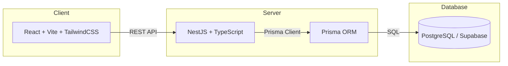

<p align="center">
  
</p>

<h1 align="center">📚 Tín Chỉ Campus — Hệ thống đăng ký học phần</h1>

<p align="center">
  Nền tảng đăng ký học phần full-stack dành cho sinh viên <strong>Học viện Công nghệ Bưu chính Viễn thông cơ sở TP.HCM (PTIT HCM)</strong>, được xây dựng làm đồ án môn học Công nghệ phần mềm.
</p>

<p align="center">
  <a href="https://github.com/athanhneee/CNPM_NHOM25/actions/workflows/ci.yml"></a>
  <a href="https://github.com/athanhneee/CNPM_NHOM25/blob/main/LICENSE"></a>
  
  
</p>

<p align="center">
  <a href="https://ptitdangkyhocphan.vercel.app/"><strong>🌐 Demo Trực Tuyến</strong></a> ·
  <a href="#-hướng-dẫn-bắt-đầu"><strong>Bắt Đầu</strong></a> ·
  <a href="#-tài-liệu-api"><strong>Tài Liệu API</strong></a> ·
  <a href="#-tài-liệu-bổ-sung"><strong>Tài Liệu</strong></a>
</p>

---

## ✨ Tính Năng Nổi Bật

| Vai trò | Chức năng |
|------|-------------|
| **🎓 Sinh viên** | Xem danh sách môn học · Đăng ký / Hủy / Đổi lớp học phần · Quản lý danh sách chờ (Waitlist) · Xem thời khóa biểu tuần & học kỳ · Gửi nguyện vọng mở lớp · Xem bảng điểm & GPA |
| **👨‍🏫 Giảng viên** | Xem các lớp học phần được phân công · Xem danh sách sinh viên từng lớp · Xem lịch giảng dạy theo tuần & học kỳ |
| **🏫 Giáo vụ** | Quản lý danh mục môn học & lớp học phần · Phân công giảng viên & phòng học · Xử lý danh sách chờ & ghi đè đăng ký · Xem báo cáo sĩ số · Duyệt / từ chối nguyện vọng mở lớp |
| **🔧 Quản trị viên (Admin)** | Quản lý người dùng (Thêm/Sửa/Xóa, khóa/mở khóa) · Import danh sách sinh viên hàng loạt (Excel) · Thiết lập hệ thống & thời gian hết hạn phiên (session) · Xem nhật ký hoạt động (Audit logs) · Xuất / nhập dữ liệu dự phòng |

---

## 🏗️ Kiến Trúc Hệ Thống



---

## 🛠️ Công Nghệ Sử Dụng

| Lớp | Công nghệ |
|-------|-------------|
| **Frontend** | React 19, Vite 8, TypeScript 5.9, Tailwind CSS 4, Zustand, React Router 7, React Hook Form + Zod, Lucide Icons |
| **Backend** | NestJS 10, TypeScript, Prisma ORM 5, Swagger/OpenAPI, JWT + RBAC, bcrypt |
| **Cơ sở dữ liệu** | PostgreSQL (Host trên Supabase), Prisma Migrations |
| **CI/CD** | GitHub Actions, Vercel (deploy frontend) |
| **Công cụ khác** | Docker Compose, ESLint, Playwright (Test E2E), Node.js 24 |

---

## 📁 Cấu Trúc Dự Án

```text
CNPM_NHOM25/
├── backend/              # API server (NestJS)
│   ├── prisma/           # Schema, migrations & dữ liệu mẫu (seed)
│   └── src/              # Các module: auth, users, courses, enrollments, v.v.
├── frontend/             # Ứng dụng SPA (React)
│   ├── src/
│   │   ├── features/     # Các trang theo vai trò (sinh viên, giảng viên, giáo vụ, admin)
│   │   ├── components/   # Các component dùng chung (UI)
│   │   ├── lib/          # Tiện ích & cấu hình
│   │   ├── mocks/        # Dữ liệu giả lập & seed dự phòng
│   │   └── types/        # Định nghĩa kiểu dữ liệu (TypeScript)
│   └── public/           # Tài nguyên tĩnh (Static assets)
├── docs/                 # Phân tích, thiết kế, kế hoạch kiểm thử & kịch bản demo
├── database/             # Tài liệu thiết lập cơ sở dữ liệu
├── docker-compose.yml    # Quản lý container (Docker)
└── .github/workflows/    # Pipeline CI/CD
```

---

## 🚀 Hướng Dẫn Bắt Đầu

### Yêu cầu hệ thống

- **Node.js** ≥ 20 (khuyên dùng: 24)
- **npm** ≥ 9
- **Cơ sở dữ liệu PostgreSQL** (hoặc dùng gói miễn phí của [Supabase](https://supabase.com))

### 1. Clone repository

```bash
git clone https://github.com/athanhneee/CNPM_NHOM25.git
cd CNPM_NHOM25
```

### 2. Thiết lập Backend

```bash
cd backend
npm install
cp .env.example .env          # Sau đó chỉnh sửa .env với thông tin database của bạn
npx prisma generate
npx prisma migrate dev
npm run prisma:seed           # Tạo dữ liệu mẫu (160 môn học, 18 giảng viên, 9 sinh viên)
npm run start:dev             # Khởi chạy tại http://localhost:3000
```

### 3. Thiết lập Frontend

```bash
cd frontend
npm install
cp .env.example .env          # API URL mặc định: http://localhost:3000/api
npm run dev                   # Khởi chạy tại http://127.0.0.1:5173
```

### 4. Dùng Docker (Tùy chọn)

```bash
docker-compose up --build
```

---

## 📖 Tài Liệu API

Khi backend đang chạy, bạn có thể truy cập giao diện Swagger UI tại:

```
http://localhost:3000/api
```

Chi tiết các API có tại: [`backend/API_CONTRACT.md`](backend/API_CONTRACT.md)

---

## 🔐 Tài Khoản Demo

Tất cả các tài khoản demo đều dùng chung mật khẩu mặc định: **`ptithcm2026`**

| Vai trò | Tên đăng nhập (Username) | Email |
|------|----------|-------|
| 🔧 Admin | `admin` | `admin@ptithcm.edu.vn` |
| 🏫 Giáo vụ | `academic.office` | `academic.office@ptithcm.edu.vn` |
| 👨‍🏫 Giảng viên | `minh.tuan` | `minh.tuan@ptithcm.edu.vn` |
| 🎓 Sinh viên | `N23DCCN001` | `n23dccn001@student.ptithcm.edu.vn` |
| 🎓 Sinh viên | `N23DCCN002` | `n23dccn002@student.ptithcm.edu.vn` |
| 🎓 Sinh viên | `N23DCAT001` | `n23dcat001@student.ptithcm.edu.vn` |
| 🎓 Sinh viên | `N23DCVT001` | `n23dcvt001@student.ptithcm.edu.vn` |
| 🎓 Sinh viên | `N23DCDT001` | `n23dcdt001@student.ptithcm.edu.vn` |

> **Mẹo nhỏ:** Trang Cài đặt của Admin có trường `simulationNow` để thay đổi thời gian giả lập của hệ thống — rất hữu ích để thử nghiệm các tính năng liên quan đến thời hạn đăng ký, đợt điều chỉnh mà không cần sửa đổi dữ liệu gốc.

---

## ✅ Kiểm Thử (Testing)

### Backend

```bash
cd backend
npm run lint                    # Kiểm tra lỗi cú pháp (ESLint)
npm run test:rules              # Kiểm thử nhanh các quy tắc nghiệp vụ
npm run test:integration        # Kiểm thử tích hợp (yêu cầu TEST_DATABASE_URL)
npm run build                   # Kiểm tra biên dịch TypeScript
```

### Frontend

```bash
cd frontend
npm run lint                    # Kiểm tra lỗi cú pháp (ESLint)
npm run test                    # Unit / seed smoke tests
npm run test:e2e                # Kiểm thử End-to-end với Playwright
npm run build                   # Build production
```

> ⚠️ Chỉ chạy `test:integration` khi `TEST_DATABASE_URL` trỏ tới một database **kiểm thử riêng biệt**. Script này sẽ xóa và reset lại toàn bộ dữ liệu mẫu trong database đó.

---

## 📊 Kịch Bản Demo

<details>
<summary><strong>🎓 Luồng của Sinh viên</strong></summary>

- Đăng nhập với `N23DCCN001` hoặc `N23DCCN002`
- Xem danh sách môn học và chi tiết các lớp học phần
- Đăng ký vào lớp học phần còn trống
- Thử đăng ký vào lớp đã đầy → chuyển vào danh sách chờ (waitlist)
- Xem lịch sử đăng ký và thời khóa biểu tuần
- Gửi và hủy nguyện vọng mở lớp

</details>

<details>
<summary><strong>👨‍🏫 Luồng của Giảng viên</strong></summary>

- Đăng nhập với `minh.tuan`
- Xem danh sách lớp được phân công và danh sách sinh viên
- Xem lịch giảng dạy tuần và học kỳ

</details>

<details>
<summary><strong>🏫 Luồng của Giáo vụ</strong></summary>

- Đăng nhập với `academic.office`
- Quản lý danh mục môn học và lớp học phần
- Tạo lớp, phân công giảng viên, cập nhật phòng học/lịch học
- Theo dõi số lượng đăng ký, xử lý danh sách chờ, ghi đè đăng ký (override)
- Xem báo cáo tỷ lệ lấp đầy lớp học
- Xem xét và phê duyệt/từ chối nguyện vọng mở lớp (kèm phản hồi)

</details>

<details>
<summary><strong>🔧 Luồng của Admin</strong></summary>

- Đăng nhập với `admin`
- Quản lý tài khoản người dùng (tạo mới, khóa/mở khóa, import hàng loạt)
- Cập nhật tham số hệ thống và thời gian hết hạn phiên
- Xuất/nhập file dữ liệu dự phòng
- Xem nhật ký hệ thống (audit logs)

</details>

---

## 📚 Tài Liệu Bổ Sung

| Tài liệu | Mô tả |
|----------|-------------|
| [Phân tích & Thiết kế](docs/analysis-design.md) | Phân tích hệ thống, Use Cases & thiết kế kiến trúc |
| [Kịch bản Demo](docs/demo-script.md) | Hướng dẫn chi tiết từng bước để demo |
| [Kế hoạch Test](docs/test-plan.md) | Chiến lược kiểm thử & các test cases |
| [Minh chứng Test thủ công](docs/manual-test-evidence.md) | Ảnh chụp màn hình & minh chứng test thủ công |
| [Hợp đồng API](backend/API_CONTRACT.md) | Đặc tả chi tiết REST API |
| [Tài liệu Frontend](frontend/README.md) | Hướng dẫn dành riêng cho Frontend |
| [Thiết lập Database](database/README.md) | Hướng dẫn cấu hình cơ sở dữ liệu |

---

## 👥 Nhóm Thực Hiện — CNPM Nhóm 25 - Nửa Vũng Tàu

**Giảng viên hướng dẫn:** Nguyễn Thị Bích Nguyên

| Họ và tên | MSSV | Lớp SV | Vai trò |
|-----------|------|--------|---------|
| Trần Đăng Khôi | N23DCAT036 | D23CQAT01-N | Trưởng nhóm |
| Nguyễn Trần Ngọc Duyên | N23DCCN016 | D23CQCN01-N | Thành viên |
| Đặng Minh Thành | N23DCCN056 | D23CQCN01-N | Thành viên |

---

## 📝 Giấy Phép

Dự án này phục vụ mục đích giáo dục cho môn học Công nghệ phần mềm tại [Học viện Công nghệ Bưu chính Viễn thông cơ sở TP.HCM (PTIT HCM)](https://ptithcm.edu.vn).

---

<p align="center">
  Làm với ❤️ bởi <strong>Nhóm 25 — PTIT HCM</strong>
</p>
