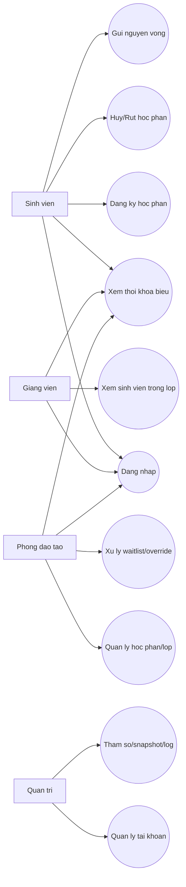
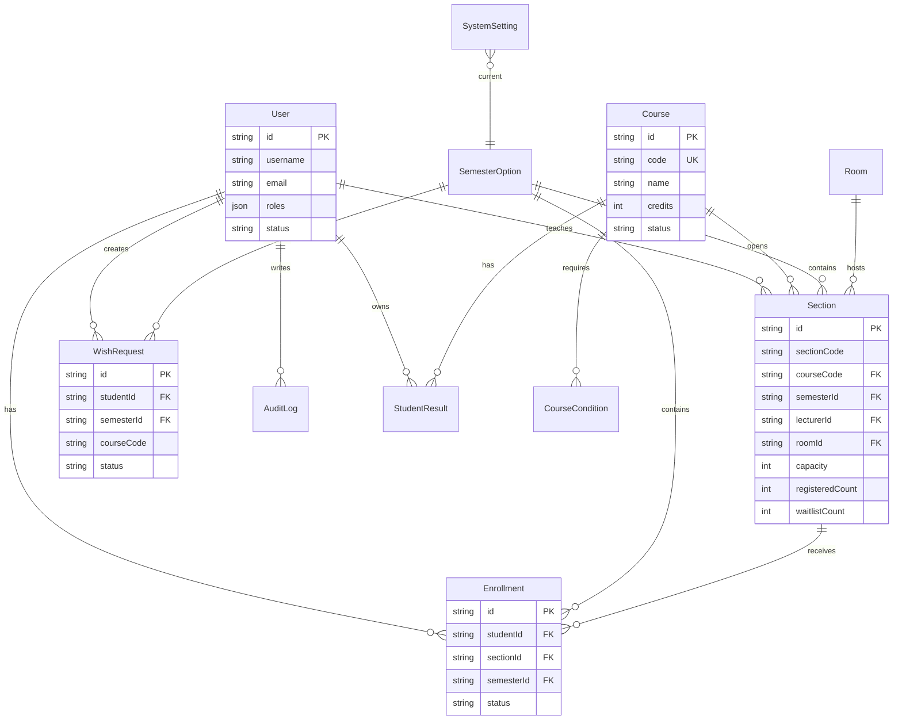
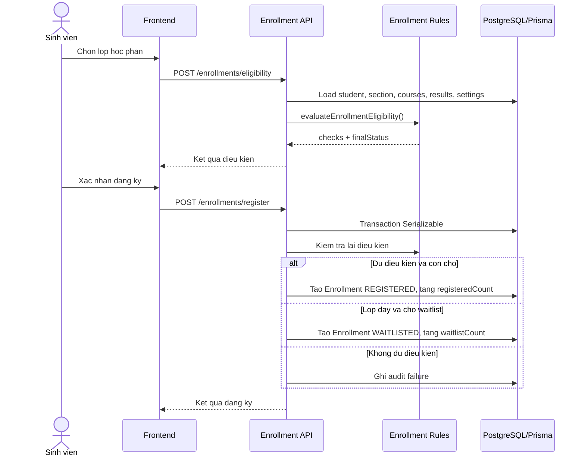
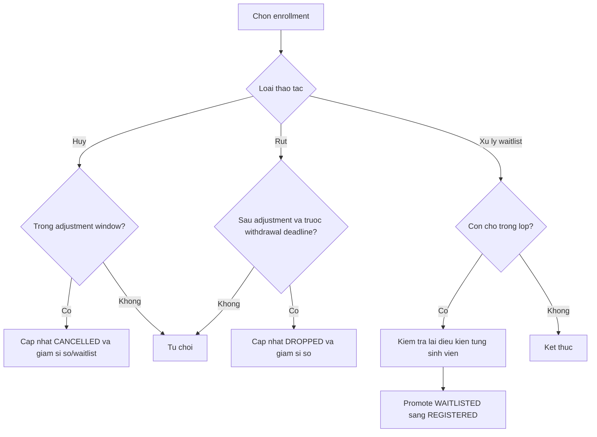

# Tai lieu phan tich thiet ke

## Pham vi

He thong ho tro dang ky hoc phan theo vai tro:
- Sinh vien: xem hoc phan, dang ky, huy/rut, waitlist, gui nguyen vong.
- Giang vien: xem lop duoc phan cong, danh sach sinh vien, lich day.
- Phong dao tao: quan ly hoc phan/lop, phan cong giang vien, xu ly waitlist/override, bao cao.
- Quan tri: quan ly tai khoan, phan quyen, tham so he thong, snapshot, audit log.

## Use Case Tom Tat

| Actor | Use case chinh |
| --- | --- |
| Sinh vien | Dang nhap, tra cuu hoc phan, kiem tra dieu kien, dang ky, huy/rut, xem TKB, gui nguyen vong |
| Giang vien | Xem lop phu trach, xem sinh vien trong lop, xem lich day |
| Phong dao tao | Tao/cap nhat hoc phan va lop, phan cong giang vien, xu ly waitlist, override, xem bao cao |
| Quan tri | Quan ly tai khoan, phan quyen, tham so, snapshot, audit log |

## ERD Rut Gon

## Sequence Dang Ky Hoc Phan

## Activity Huy/Rut/Waitlist

## Kien Truc

Frontend goi API backend that qua `frontend/src/services/*.api.ts`. Zustand giu state UI/cache phia client. Backend NestJS chia module theo nghiep vu: Auth, Users, Courses, Sections, Enrollments, Schedules, Reports, Settings, Logs, Snapshot, Wishes. Prisma schema la nguon chinh cho cau truc database va migration.
