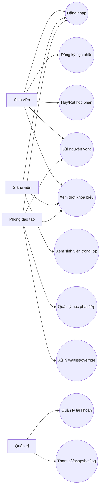
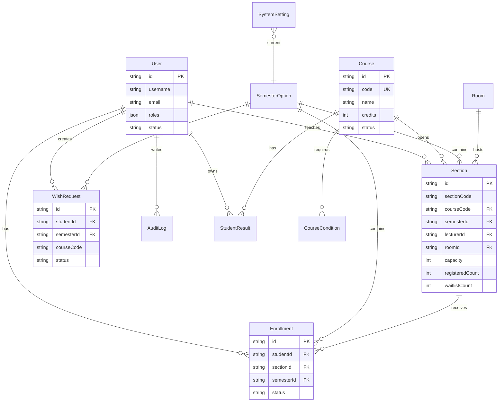
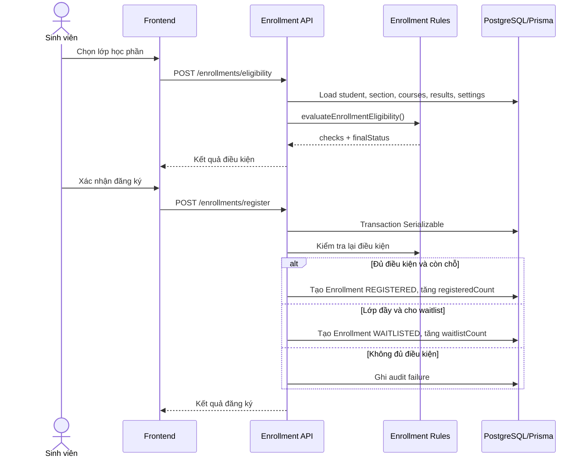

# Tài liệu phân tích thiết kế

## Phạm vi

Hệ thống hỗ trợ đăng ký học phần theo vai trò:
- Sinh viên: xem học phần, đăng ký, hủy/rút, waitlist, gửi nguyện vọng.
- Giảng viên: xem lớp được phân công, danh sách sinh viên, lịch dạy.
- Phòng đào tạo: quản lý học phần/lớp, phân công giảng viên, xử lý waitlist/override, báo cáo, duyệt nguyện vọng.
- Quản trị: quản lý tài khoản, phân quyền, tham số hệ thống, snapshot, audit log.

## Use Case Tóm Tắt

| Actor | Use case chính |
| --- | --- |
| Sinh viên | Đăng nhập, tra cứu học phần, kiểm tra điều kiện, đăng ký, hủy/rút, xem TKB, gửi nguyện vọng |
| Giảng viên | Xem lớp phụ trách, xem sinh viên trong lớp, xem lịch dạy |
| Phòng đào tạo | Tạo/cập nhật học phần và lớp, phân công giảng viên, xử lý waitlist, override, xem báo cáo, duyệt/từ chối nguyện vọng |
| Quản trị | Quản lý tài khoản, phân quyền, tham số, snapshot, audit log |

## ERD Rút Gọn

## Sequence Đăng Ký Học Phần

## Activity Hủy/Rút/Waitlist

## Kiến Trúc

Frontend gọi API backend thật qua `frontend/src/services/*.api.ts`. Zustand giữ state UI/cache phía client. Backend NestJS chia module theo nghiệp vụ: Auth, Users, Courses, Sections, Enrollments, Schedules, Reports, Settings, Logs, Snapshot, Wishes. Prisma schema là nguồn chính cho cấu trúc database và migration.

Mock/localStorage không thay thế backend cho đăng nhập, phân quyền hoặc mutation học vụ quan trọng; chúng chỉ giúp UI còn dữ liệu hiển thị khi API lỗi hoặc dùng cho demo phụ trợ.
